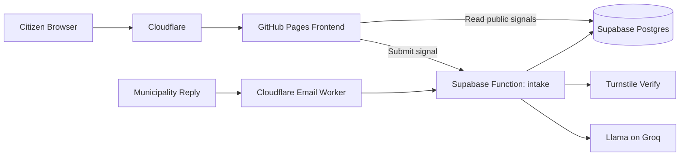
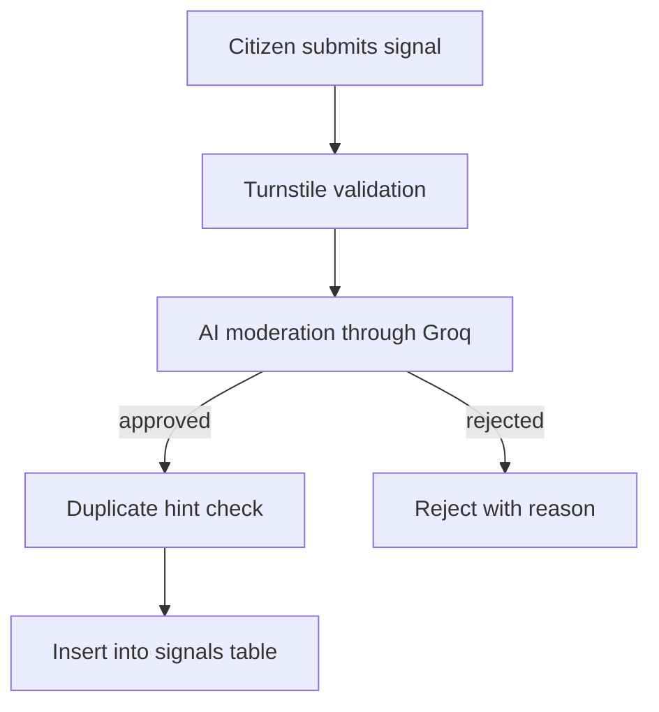
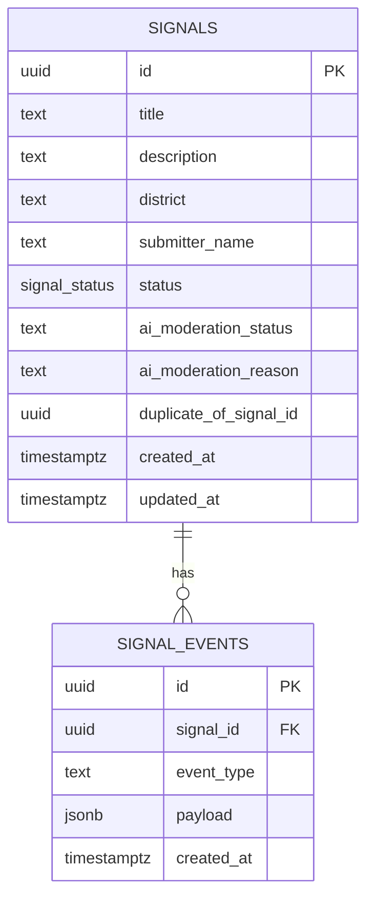

# Transparent Ruse

Transparent Ruse is a civic transparency platform for collecting, moderating, and publishing municipality-related citizen signals.

This project follows an open-source, free-tier-first architecture:
- frontend on GitHub Pages
- backend on Supabase (Postgres + Edge Functions)
- security and DNS through Cloudflare
- AI moderation via Groq (Llama)

---

## Product Status

Current implementation includes:
- Bulgarian as the default UI language, with optional English switch
- dark/light theme switch with persistent selection
- top menu with separate dashboard and submission views
- mobile-friendly hamburger top menu with controls
- public signal list and status pie chart
- click-to-open fullscreen signal details modal
- relevance voting and automatic priority ranking
- submission form with camera capture and file uploads
- live Supabase read integration (`signals` table)
- Supabase intake function with optional Turnstile verification and AI moderation
- fallback to local mock data when frontend env is missing

---

## Immortal Stack

| Layer | Technology | Provider | Purpose |
|---|---|---|---|
| DNS & Security | Cloudflare | Cloudflare | Proxy, SSL, WAF, bot protection, email routing |
| Frontend (PWA) | React + Vite + TypeScript | GitHub Pages | Fast static public app |
| Backend Logic | Supabase Edge Functions (Deno TS) | Supabase | Submission handling, moderation orchestration |
| Database | PostgreSQL | Supabase | Signals, events, statuses |
| AI Layer | Llama API | Groq Cloud | Moderation and duplicate hints |
| Email Service | Resend + Cloudflare Workers | Hybrid | Outbound official reports + inbound responses |

---

## Architecture Diagram



## Moderation and Anti-Spam Flow



---

## Local Development

### Requirements

- Node.js 20+
- npm 10+

### Frontend

```bash
npm install
npm run dev
```

### Frontend environment

Create `.env` from `.env.example` and configure:

```bash
VITE_SUPABASE_URL=https://<project-ref>.supabase.co
VITE_SUPABASE_ANON_KEY=<anon-key>
VITE_SUPABASE_INTAKE_URL=https://<project-ref>.functions.supabase.co/intake
VITE_SUPABASE_VOTE_URL=https://<project-ref>.functions.supabase.co/vote
VITE_TURNSTILE_SITE_KEY=<turnstile-site-key>
```

Without these values, the app still runs with local sample data.

---

## Deployment

### Frontend (GitHub Pages)

The repository includes a ready workflow at `.github/workflows/deploy-pages.yml`.

1) In GitHub, open **Settings -> Pages** and set **Source** to `GitHub Actions`.

2) In GitHub, add repository secrets:
- `VITE_SUPABASE_URL`
- `VITE_SUPABASE_ANON_KEY`
- `VITE_SUPABASE_INTAKE_URL`
- `VITE_SUPABASE_VOTE_URL`
- `VITE_TURNSTILE_SITE_KEY`

3) Optional: add repository variable `VITE_BASE_PATH`
- for default GitHub Pages repo URL use `/<repo-name>/`
- for custom domain on root use `/`

4) Push to `main` (or run the workflow manually) and GitHub Pages will build and publish `dist/`.

### Backend (Supabase)

### 1) Apply database schema

```bash
supabase link --project-ref <project-ref>
supabase db push
```

### 2) Configure Edge Function secrets

```bash
supabase secrets set SUPABASE_SERVICE_ROLE_KEY=...
supabase secrets set GROQ_API_KEY=...
supabase secrets set TURNSTILE_SECRET_KEY=...
supabase secrets set SUPABASE_STORAGE_BUCKET=signal-attachments
```

### 3) Deploy intake function

```bash
supabase functions deploy intake
supabase functions deploy vote
```

### 4) Smoke test intake

```bash
curl -X POST "https://<project-ref>.functions.supabase.co/intake" \
  -H "Content-Type: application/json" \
  -d "{\"title\":\"Broken sidewalk\",\"description\":\"Long damaged sidewalk section near school entrance with safety risk.\",\"district\":\"Center\"}"
```

### 5) Deploy checklist

- Frontend URL opens correctly from GitHub Pages.
- Signal read works from `signals`.
- Submission reaches `intake` function.
- Attachments are uploaded in `signal-attachments`.
- Voting reaches `vote` function.
- Timeline events are visible in the signal modal.

---

## Database Model



---

## Repository Structure

```text
.
├─ src/
│  ├─ components/
│  ├─ data/
│  ├─ i18n.ts
│  ├─ lib/
│  ├─ App.tsx
│  └─ main.tsx
├─ supabase/
│  ├─ functions/intake/
│  ├─ migrations/
│  └─ README.md
├─ transparent_ruse.md
└─ README.md
```

---

## Security Notes

- Keep `SUPABASE_SERVICE_ROLE_KEY` only in Supabase function secrets.
- Keep all AI and moderation logic on server-side functions.
- Keep public frontend read-only through RLS.
- Put Cloudflare WAF and rate-limits in front of public entry points.

---

## Next Milestones

- [ ] Add Cloudflare Turnstile token generation in the frontend form
- [ ] Add similarity search with pgvector/embeddings for robust deduplication
- [ ] Add municipality response ingestion function and event timeline
- [x] Add GitHub Actions workflow for frontend deployment (GitHub Pages)
- [ ] Add notifications when critical signal score increases

---

## License

MIT
