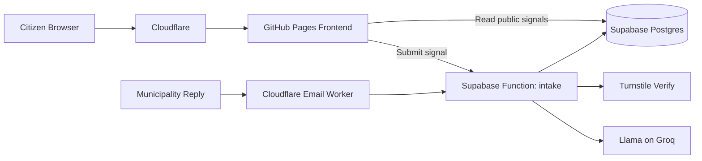
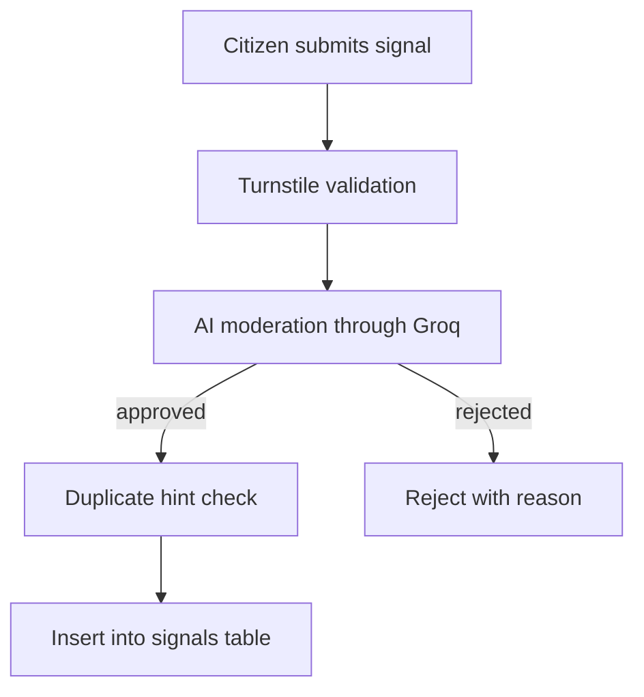
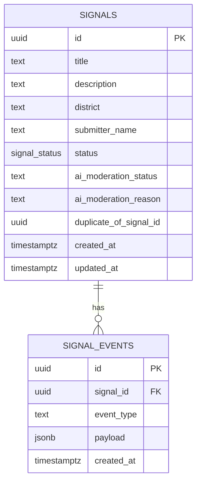

# Transparent Ruse

Transparent Ruse is a civic transparency platform for collecting, moderating, and publishing municipality-related citizen signals.

This project follows an open-source, free-tier-first architecture:
- frontend on GitHub Pages
- backend on Supabase (Postgres + Edge Functions)
- security and DNS through Cloudflare
- AI moderation via Groq (Llama)

---

## Product Status

Current implementation includes:
- Bulgarian as the default UI language, with optional English switch
- dark/light theme switch with persistent selection
- top menu with separate dashboard and submission views
- mobile-friendly hamburger top menu with controls
- public signal list and status pie chart
- click-to-open fullscreen signal details modal
- relevance voting and automatic priority ranking
- submission form with camera capture and file uploads
- live Supabase read integration (`signals` table)
- Supabase intake function with optional Turnstile verification and AI moderation
- fallback to local mock data when frontend env is missing

---

## Immortal Stack

| Layer | Technology | Provider | Purpose |
|---|---|---|---|
| DNS & Security | Cloudflare | Cloudflare | Proxy, SSL, WAF, bot protection, email routing |
| Frontend (PWA) | React + Vite + TypeScript | GitHub Pages | Fast static public app |
| Backend Logic | Supabase Edge Functions (Deno TS) | Supabase | Submission handling, moderation orchestration |
| Database | PostgreSQL | Supabase | Signals, events, statuses |
| AI Layer | Llama API | Groq Cloud | Moderation and duplicate hints |
| Email Service | Resend + Cloudflare Workers | Hybrid | Outbound official reports + inbound responses |

---

## Architecture Diagram


```mermaid
flowchart LR
    U[Citizen Browser] --> CF[Cloudflare]
    CF --> GH[GitHub Pages Frontend]
    GH -->|Read public signals| DB[(Supabase Postgres)]
    GH -->|Submit signal| IF[Supabase Function: intake]
    IF --> TV[Turnstile Verify]
    IF --> AI[Llama on Groq]
    IF --> DB
    MUNI[Municipality Reply] --> CFW[Cloudflare Email Worker]
    CFW --> IF
```

## Moderation and Anti-Spam Flow


```mermaid
flowchart TD
    A[Citizen submits signal] --> B[Turnstile validation]
    B --> C[AI moderation through Groq]
    C -->|approved| D[Duplicate hint check]
    D --> E[Insert into signals table]
    C -->|rejected| F[Reject with reason]
```

---

## Local Development

### Requirements

- Node.js 20+
- npm 10+

### Frontend

```bash
npm install
npm run dev
```

### Frontend environment

Create `.env` from `.env.example` and configure:

```bash
VITE_SUPABASE_URL=https://<project-ref>.supabase.co
VITE_SUPABASE_ANON_KEY=<anon-key>
VITE_SUPABASE_INTAKE_URL=https://<project-ref>.functions.supabase.co/intake
VITE_SUPABASE_VOTE_URL=https://<project-ref>.functions.supabase.co/vote
VITE_TURNSTILE_SITE_KEY=<turnstile-site-key>
```

Without these values, the app still runs with local sample data.

---

## Testing

The project uses [Vitest](https://vitest.dev) + [React Testing Library](https://testing-library.com/react) for both the frontend and the pure business-logic modules shared by the Supabase Edge Functions.

```bash
npm run test        # run the full suite once (used in CI)
npm run test:watch  # interactive watch mode while developing
```

What is covered today:

| Area | File(s) | What it protects against |
|---|---|---|
| Neighborhood name canonicalization | `src/data/ruseNeighborhoods.test.ts` | District text (Bulgarian/English, aliases, "ЖК" prefixes) failing to resolve to the correct map/filter id |
| Signal row → view-model mapping | `src/lib/signals.test.ts` | Broken attachment/timeline mapping, wrong fallback timeline, wrong neighborhood resolution, blank district not falling back to "Unknown" |
| Voting client | `src/lib/vote.test.ts` | Wrong request payload, voter-fingerprint not being stable, errors not surfacing to the UI, silent no-op when the vote endpoint isn't configured |
| Voting UI regression | `src/App.test.tsx` | The exact "stale modal" bug fixed in `236d9ef` — an open signal modal must reflect live vote counts, not a frozen snapshot |
| Signal submission form | `src/components/SignalForm.test.tsx` | Moderation rejection reason not reaching the user; submit button enabling logic; optional submitter name field |
| Neighborhood map card | `src/components/NeighborhoodMapCard.test.tsx` | Broken stats aggregation by neighborhood, collapsed/expanded list toggle, click-to-filter behavior |
| Status pie chart | `src/components/StatusPieChart.test.tsx` | Wrong per-status counts in the legend |
| Edge Function moderation policy | `supabase/functions/_shared/moderation.test.ts` | Malformed AI responses silently blocking submissions; duplicate-detection false positives/negatives |
| Edge Function vote priority | `supabase/functions/_shared/priority.test.ts` | Wrong priority thresholds when vote scores change |
| Edge Function text fallback | `supabase/functions/_shared/text.test.ts` | `?? fallback` missing the common case of an empty-string form field (district, submitter name) |

Business logic used by the Supabase Edge Functions (`intake`, `vote`) is factored out into `supabase/functions/_shared/*.ts` — plain TypeScript with no Deno-specific APIs — specifically so it can run under the same Vitest suite as the frontend, without requiring a local Deno install.

CI (`.github/workflows/ci.yml`) runs `lint`, `test`, and `build` on every push/PR to `main`.

---

## Bug Bounty — Known Issues

| Status | Issue | Notes |
|---|---|---|
| ✅ Fixed | Upvote/Downvote did not update the open signal modal | The modal read from a frozen `selectedSignal` snapshot instead of live state. Fixed in `236d9ef`; regression-tested in `src/App.test.tsx`. |
| ✅ Fixed | AI rejected signals without telling the user why | Backend already returned `moderation_reason`, but the form only showed the generic error. `SignalForm` now appends the moderation reason to the error banner. |
| ✅ Fixed | Voting silently did nothing (but still showed "success") if `VITE_SUPABASE_VOTE_URL` was missing | `voteSignal()` fell through without returning or throwing. It now always throws a clear error when the vote endpoint isn't configured. |
| ✅ Fixed | Signals submitted without picking a neighborhood were stored with `district = ""` instead of `"Unknown"` | `payload.district ?? "Unknown"` doesn't catch empty strings (only `null`/`undefined`), which is exactly what an unselected dropdown sends. Same bug existed for `submitter_name` and on the frontend read path in `signals.ts`. Fixed via a shared `resolveOrFallback()` helper (backend) and an equivalent check in `mapRowToSignal` (frontend). |

If you find new issues, please open a GitHub issue describing the steps to reproduce, and add a regression test alongside the fix when possible.

---

## Admin Portal

The admin portal is a protected area for editing signals, testing the AI mediator, and simulating municipality communication flows before wiring real email automation.

## AI Test Bench (Prompt testing module)

The admin portal includes a **Testing** tab designed for prompt iteration and repeatable test scenarios. It is meant to be safe for non-developers: they can edit prompts, run tests, and review run history without changing code.

### What it stores

- `ai_test_cases`: reusable test scenarios (kind, system prompt, user payload)
- `ai_test_runs`: immutable run history (model, prompt, payload, raw output, parsed output)

Both tables are **admin-only** via RLS (`is_admin()`).

### How to use (non-technical workflow)

1) Open `/#admin` and sign in.
2) Go to **Testing**.
3) Create a new test case.
4) Pick the kind:
   - `response_review`: municipality reply evaluation
   - `moderation`: citizen submission moderation
5) Edit the **system prompt** and the **user payload JSON**.
6) Click **Run test**.
7) The parsed JSON is shown immediately, and the run is stored in `ai_test_runs`.

### JSON payload shapes

- `response_review` payload:

```json
{
  "signalTitle": "Broken streetlight",
  "signalDescription": "The lights near the monument are not working.",
  "municipalityResponse": "We will inspect by 15 Jul 2026."
}
```

- `moderation` payload:

```json
{
  "title": "Pothole near school",
  "description": "Large pothole on the road, dangerous for bikes.",
  "district": "Център"
}
```

### Access

Open the app with the hash route:

`https://<your-site>/#admin`

Example locally: `http://localhost:5173/#admin`

Only users listed in `admin_profiles` can use the portal after email/password sign-in.

### One-time setup

1) Enable **Email** provider in Supabase Auth (Dashboard -> Authentication -> Providers).

2) Create an admin user (Dashboard -> Authentication -> Users -> Add user).

3) Apply migrations (includes `admin_profiles` and admin RLS policies):

```bash
npx supabase db push
```

4) Grant admin access to that user (SQL editor or migration seed):

```sql
insert into public.admin_profiles (user_id, display_name)
values ('<auth-user-uuid>', 'Platform Admin');
```

5) Deploy the admin API function (**JWT verification enabled** — do not pass `--no-verify-jwt`):

```bash
npx supabase functions deploy admin-api --use-api
```

6) Optional frontend env override:

```env
VITE_SUPABASE_ADMIN_URL=https://<project-ref>.functions.supabase.co/admin-api
```

If omitted, the client derives it from `VITE_SUPABASE_URL`.

### Admin capabilities (current)

| Tab | Purpose |
|---|---|
| **Signals** | Edit signals, attachments, timeline |
| **Workbench** | Municipality reply test + full flow simulation + AI prompt tests — always with selected signal visible |
| **Settings** | Catalog (neighborhoods, prompts, emails), flow diagrams, admin users |

### Security model

- Auth: Supabase email/password session (JWT sent to `admin-api`)
- Authorization: `admin_profiles` table + `is_admin()` helper (not `user_metadata`)
- Writes: authenticated admin JWT + RLS policies on `signals` / `signal_events`
- AI calls: Groq key stays in Supabase secrets (never exposed to the browser)

---

## Deployment

### Frontend (GitHub Pages)

The repository includes a ready workflow at `.github/workflows/deploy-pages.yml`.

1) In GitHub, open **Settings -> Pages** and set **Source** to `GitHub Actions`.

2) In GitHub, add repository secrets:
- `VITE_SUPABASE_URL`
- `VITE_SUPABASE_ANON_KEY`
- `VITE_SUPABASE_INTAKE_URL`
- `VITE_SUPABASE_VOTE_URL`
- `VITE_TURNSTILE_SITE_KEY`

3) Optional: add repository variable `VITE_BASE_PATH`
- for default GitHub Pages repo URL use `/<repo-name>/`
- for custom domain on root use `/`

4) Push to `main` (or run the workflow manually) and GitHub Pages will build and publish `dist/`.

### Backend (Supabase)

### 1) Apply database schema

```bash
supabase link --project-ref <project-ref>
supabase db push
```

### 2) Configure Edge Function secrets

```bash
supabase secrets set SUPABASE_SERVICE_ROLE_KEY=...
supabase secrets set GROQ_API_KEY=...
supabase secrets set TURNSTILE_SECRET_KEY=...
supabase secrets set SUPABASE_STORAGE_BUCKET=signal-attachments
```

### 3) Deploy intake function

```bash
supabase functions deploy intake
supabase functions deploy vote
supabase functions deploy admin-api --use-api
```

### 4) Smoke test intake

```bash
curl -X POST "https://<project-ref>.functions.supabase.co/intake" \
  -H "Content-Type: application/json" \
  -d "{\"title\":\"Broken sidewalk\",\"description\":\"Long damaged sidewalk section near school entrance with safety risk.\",\"district\":\"Center\"}"
```

### 5) Deploy checklist

- Frontend URL opens correctly from GitHub Pages.
- Signal read works from `signals`.
- Submission reaches `intake` function.
- Attachments are uploaded in `signal-attachments`.
- Voting reaches `vote` function.
- Timeline events are visible in the signal modal.

---

## Database Model


```mermaid
erDiagram
    SIGNALS {
      uuid id PK
      text title
      text description
      text district
      text submitter_name
      signal_status status
      text ai_moderation_status
      text ai_moderation_reason
      uuid duplicate_of_signal_id
      timestamptz created_at
      timestamptz updated_at
    }

    SIGNAL_EVENTS {
      uuid id PK
      uuid signal_id FK
      text event_type
      jsonb payload
      timestamptz created_at
    }

    SIGNALS ||--o{ SIGNAL_EVENTS : has
```

---

## Repository Structure

```text
.
├─ src/
│  ├─ components/       # UI components (+ *.test.tsx)
│  ├─ data/              # neighborhoods, mock data (+ *.test.ts)
│  ├─ lib/                # Supabase/vote/signals clients (+ *.test.ts)
│  ├─ test/setup.ts     # Vitest/jsdom test setup
│  ├─ i18n.ts
│  ├─ App.tsx
│  └─ main.tsx
├─ supabase/
│  ├─ functions/
│  │  ├─ _shared/        # pure moderation/priority logic (+ *.test.ts)
│  │  ├─ intake/
│  │  └─ vote/
│  ├─ migrations/
│  └─ README.md
├─ .github/workflows/
│  ├─ ci.yml              # lint + test + build on push/PR
│  └─ deploy-pages.yml    # GitHub Pages deployment
├─ vitest.config.ts
├─ transparent_ruse.md
└─ README.md
```

---

## Security Notes

- Keep `SUPABASE_SERVICE_ROLE_KEY` only in Supabase function secrets.
- Keep all AI and moderation logic on server-side functions.
- Keep public frontend read-only through RLS.
- Put Cloudflare WAF and rate-limits in front of public entry points.

---

## Continuation Strategy / Next Milestones

Ordered by priority. Items marked "(external setup needed)" require a decision or a resource (domain, API key) from the project owner before they can be implemented in code.

### 1. Correctness & regression safety — mostly done
- [x] Add automated test suite (Vitest + RTL) covering voting, moderation feedback, and neighborhood mapping
- [x] Add CI workflow that runs lint + test + build on every push/PR
- [x] Fix stale-modal voting bug (regression-tested)
- [x] Fix missing AI rejection feedback in the submission form
- [x] Fix `normalizeNeighborhoodKey` leading-space bug found by the new tests
- [x] Add an explicit AI moderation accept/reject policy (see `supabase/functions/_shared/moderation.ts`)
- [x] Add admin portal with Supabase Auth, signal editing, AI mediator test bench, and municipality flow simulation

### 2. Municipality communication loop
- [x] AI response review policy (`supabase/functions/_shared/responseReview.ts`) — used in admin test bench
- [ ] Outbound email: call Resend from the `intake` function (or a follow-up function) once a signal is approved; store the outbound message id in `signal_events`
- [ ] Inbound email: Cloudflare Email Worker → HTTP call to a new Supabase function → parse the municipality's reply → insert a `municipality_response` event → run the AI satisfaction check → insert `ai_response_review`
- [ ] Requires a domain routed through Cloudflare and a Resend account (external setup needed)

### 3. Anti-abuse hardening
- [ ] Wire up `VITE_TURNSTILE_SITE_KEY` end-to-end on the live domain and confirm `TURNSTILE_SECRET_KEY` verification in `intake` (external setup needed: production domain)
- [ ] Add IP/device rate limiting (Cloudflare rule or a Supabase-side counter) before AI moderation runs
- [ ] Revisit `--no-verify-jwt` on `intake`/`vote` before public scale-up (shared secret header, or anon JWT-only calls)
- [ ] Rotate any keys/tokens that were ever shared over insecure channels

### 4. Product polish
- [ ] Active tab indicator in the top navigation
- [ ] Voting anti-abuse (e.g. cap votes per fingerprint per day)
- [ ] Filter non-neighborhood SVG paths from the sidebar list only (map should still render them neutrally)
- [ ] Similarity search with pgvector/embeddings for more robust deduplication than the current text-prefix heuristic

### 5. Ops
- [ ] GitHub Action to run `supabase db push` + `supabase functions deploy` on merge to `main`
- [ ] Basic uptime/error monitoring or alerting for the Edge Functions
- [ ] Confirm `VITE_BASE_PATH` / GitHub Pages settings whenever the repository is renamed

---

## License

MIT
