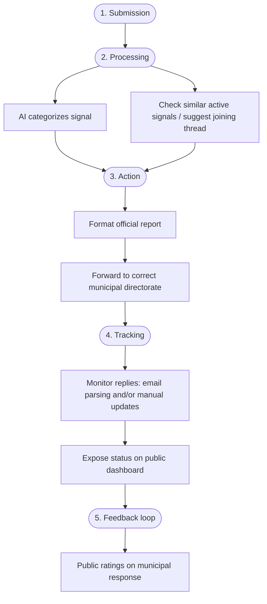
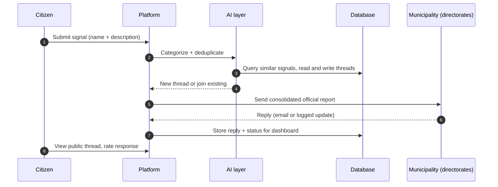
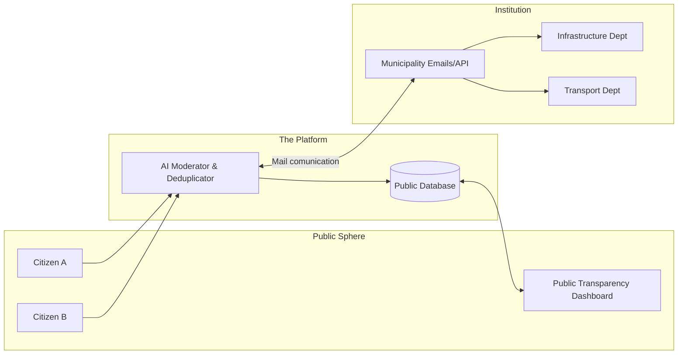
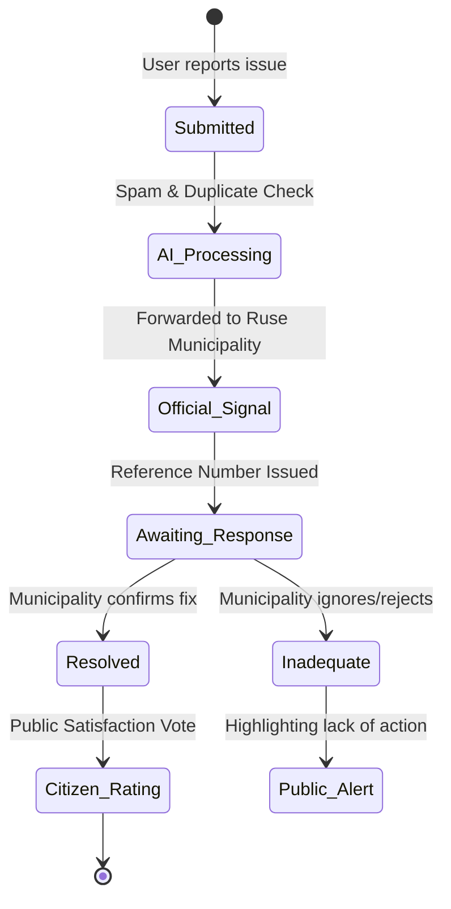

# Project Proposal: "Transparent Ruse" (Civic Alert Platform)

## 1. Executive Summary
"Transparent Ruse" is a proposed independent digital platform designed to bridge the gap between the citizens of Ruse and the municipal administration. By simplifying the reporting process, utilizing Artificial Intelligence (AI) for moderation and data consolidation, and ensuring 100% public transparency, the platform aims to hold local authorities accountable and foster a more proactive civic society.

## 2. Problem Statement
The current system for reporting urban issues in Ruse suffers from several critical flaws:
* **Lack of Transparency:** Official correspondence via email is one-sided. Citizens have no guarantee that their emails are processed or assigned a reference number.
* **Gatekeeping:** Major social media groups are often moderated by municipal affiliates, leading to the deletion of critical posts and "sinking" of legitimate signals.
* **High Friction:** The formal process is cumbersome, discouraging citizens from reporting issues.
* **Fragmented Communication:** Information about existing problems is scattered, leading to duplicated efforts or ignored complaints.

## 3. The Solution
An independent, public-facing platform that acts as an intermediary between citizens and the municipality.

### Key Features:
* **Low Barrier to Entry:** No account registration required. Citizens can submit reports using only their name and a free-text description of the issue.
* **AI-Driven Intelligent Response:** * **Deduplication:** When a user starts typing, the AI checks the database for existing reports on the same topic/location and informs the user about the current status of that issue.
    * **Spam/Troll Detection:** AI filters out non-constructive content, ensuring the platform remains professional and credible.
* **Consolidated Communication:** The platform sends official reports to relevant municipal departments from a verified organizational email address.
* **Public Tracking & Statistics:** Every report, municipal response, and resolution status is 100% public. The platform will generate statistics on municipal efficiency and satisfaction rates.

## 4. Technical Workflow
1.  **Submission:** User enters a signal (e.g., "Broken glass at the bus stop on Street X").
2.  **Processing:** * AI categorizes the signal.
    * AI checks for similar active signals to encourage "joining" an existing thread rather than creating a new one.
3.  **Action:** The platform automatically formats and forwards the signal to the correct municipal directorate.
4.  **Tracking:** The system monitors for incoming replies (via automated email parsing or manual updates) and displays them on the public dashboard.
5.  **Feedback Loop:** Citizens can rate the municipality's response, creating a public performance record.

The diagrams below summarize the same pipeline at different levels of detail.

### End-to-end technical workflow

### System sequence (components and messages)

### Communication Architecture

### Data Transparency Lifecycle

## 5. Objectives & Impact
* **Empowerment:** Give citizens a voice that cannot be silenced by social media moderators.
* **Accountability:** Force the municipality to respond to public, timestamped signals.
* **Efficiency:** Reduce the administrative burden by consolidating similar complaints into single communication threads.
* **Data-Driven Governance:** Provide the community with hard data on which city departments are performing well and which are failing.

## 6. Next Steps
* **Stakeholder Engagement:** Form a core team of developers, legal experts, and civic activists.
* **Technical Audit:** Investigate the municipality's existing digital infrastructure for potential API integration or standardized email routing.
* **MVP Development:** Build a Minimum Viable Product focusing on one specific neighborhood or type of issue (e.g., infrastructure).
* **Launch & Promotion:** Grassroots marketing to shift civic activity from private Facebook groups to the transparent platform.
